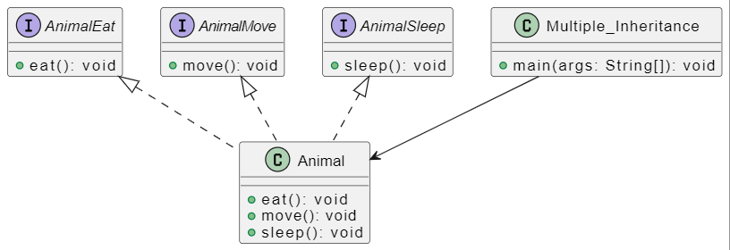

# Multiple Inheritance Java Program

This Java program demonstrates the concept of multiple inheritance using interfaces. It defines three interfaces: `AnimalEat`, `AnimalMove`, and `AnimalSleep`. The `Animal` class implements all three interfaces, showcasing multiple inheritance. The `Multiple_Inheritance` class contains the main method to instantiate an `Animal` object and call its methods.

## Problem Description

Write a Java program that demonstrates multiple inheritance through interfaces. The program uses an `Animal` class, which implements three interfaces (`AnimalEat`, `AnimalMove`, and `AnimalSleep`). The goal is to illustrate the ability to inherit behaviors from multiple sources.

## UML Class Diagram

