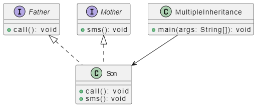

# Multiple Inheritance Java Program

This Java program demonstrates the concept of multiple inheritance using interfaces. It defines three interfaces: `Father`, and `Mother`. The `Son` class implements all the two interfaces, showcasing multiple inheritance. The `MultipleInheritance` class contains the main method to instantiate an `Son` object and call its methods.

## Problem Description

Write a Java program that demonstrates multiple inheritance through interfaces. The program uses an `Son` class, which implements tow interfaces (`Father`, and `Mother`). The goal is to illustrate the ability to inherit behaviors from multiple sources.

## UML Class Diagram

