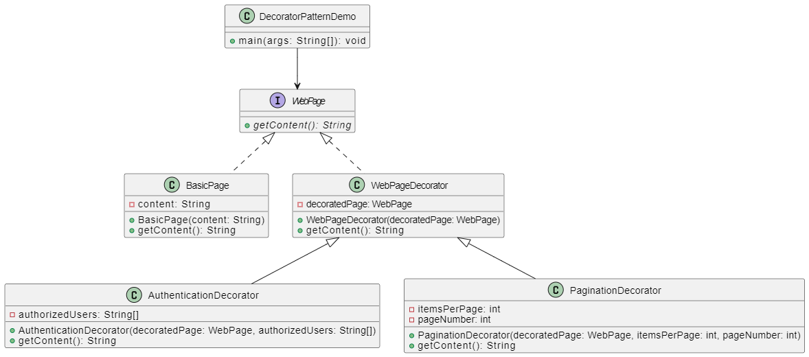

# Decorator Design Pattern Example

## Overview

This Java program demonstrates the Decorator design pattern, which is a structural pattern that allows additional behaviors to be added to an individual object, either statically or dynamically, without affecting the behavior of other objects from the same class.

In this example, we have a `WebPage` interface representing the component, a concrete component `BasicWebPage`, and two decorators `AuthorizedWebPage` and `AuthenticatedWebPage`. These decorators add authorization and authentication functionality to the basic web page.

## UML Class Diagram



## Implementation of this design pattern with Java can be broken down into steps.
1. Design the component interface.
2. Implement the interface with your base concrete
component class.
3. Implement the interface with your abstract decorator
class.
4. Inherit from the abstract decorator and implement the
component interface with concrete decorator classes.


## Code Explanation

```java
// Component Interface
interface WebPage {
    public void display();
}
  
// Concrete Component
class BasicWebPage implements WebPage {
    @Override
    public void display() {
        System.out.println("Basic Web Page");
    }
}

abstract class WebPageDecorator implements WebPage {
    protected WebPage page;

    public WebPageDecorator(WebPage page) {
        this.page = page;
    }

    @Override
    public void display() {
        page.display();
    }
}

class AuthorizedWebPage extends WebPageDecorator {
    public AuthorizedWebPage(WebPage decoratedWebPage) {
        super(decoratedWebPage);
    }

    private void authorizeUser() {
        System.out.println("Authorizing user");
    }

    @Override
    public void display() {
        authorizeUser();
        super.display();
    }
}
  
// Concrete Decorator - Paginated Results
class AuthenticatedWebPage extends WebPageDecorator {
    public AuthenticatedWebPage(WebPage decoratedWebPage) {
        super(decoratedWebPage);
    }

    public void authenticateUser() {
        System.out.println("Authenticating user");
    }

    @Override
    public void display() {
        super.display();
        authenticateUser();
    }
}
  
// Example Usage
public class DecoratorPatternDemo{
    public static void main(String[] args) {
        WebPage myPage = new BasicWebPage();                // Basic page with some content
        myPage = new AuthorizedWebPage(myPage);             // Decorate with authentication check for specific users
        myPage = new AuthenticatedWebPage(myPage);          // Further decorate with pagination or authentication
        
        myPage.display();
    }
}
  