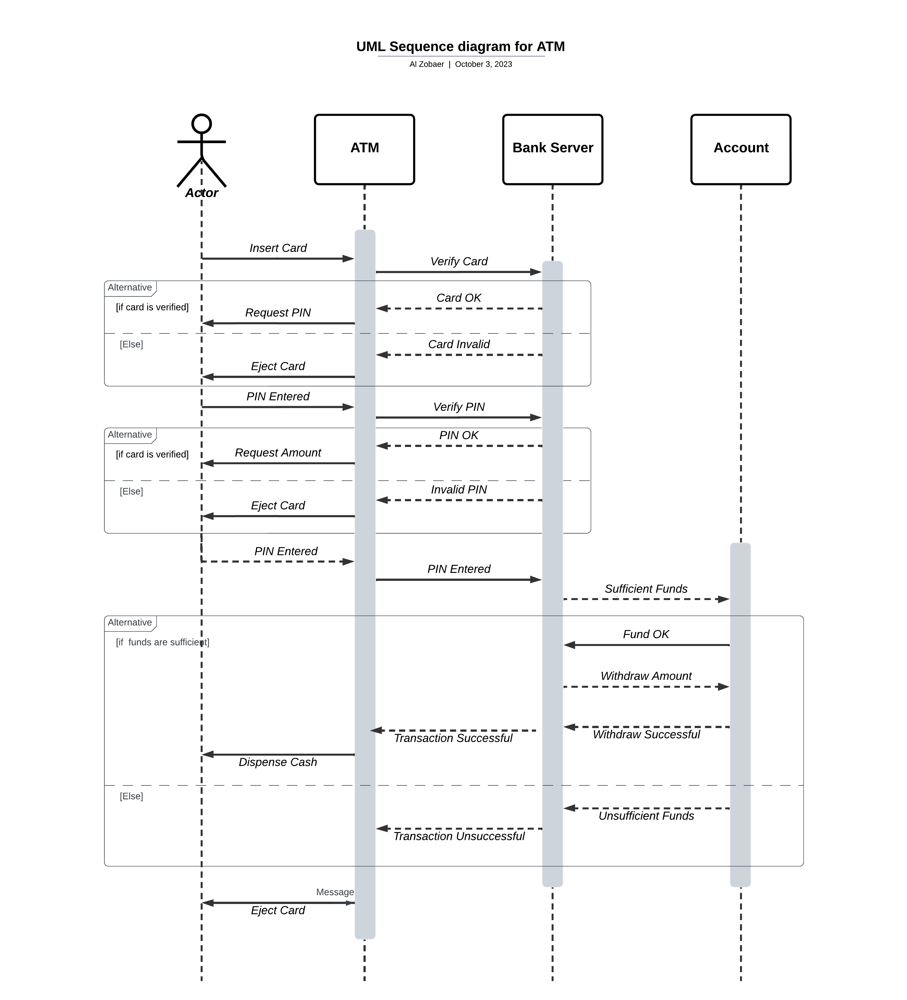

# ATM Machine UML Sequence Diagram

This repository contains a UML sequence diagram that illustrates the interactions between various components and actors in an ATM (Automated Teller Machine) system. The sequence diagram is created using UML notation and provides a visual representation of how a typical ATM transaction takes place.

## UML Sequence Diagram Overview

The UML sequence diagram in this repository depicts the following key interactions:

1. **User**: The actor initiating the ATM transaction by inserting their ATM card and entering a PIN.

2. **ATM Machine**: The ATM machine itself, which interacts with the user and communicates with the bank's system to process the transaction.

3. **Bank System**: The backend system of the bank that handles user account information and processes ATM transactions.

## Sequence of Steps

The sequence diagram demonstrates a simplified ATM transaction scenario. Here are the step-by-step interactions as depicted in the diagram:

### 1. User Inserts ATM Card
   - The user inserts their ATM card into the ATM machine.

### 2. User Enters PIN
   - The user enters their Personal Identification Number (PIN) using the ATM machine's keypad.

### 3. ATM Machine Validates Card
   - The ATM machine verifies the user's card, ensuring it's valid and belongs to the same bank.

### 4. ATM Machine Validates PIN
   - The ATM machine sends the entered PIN to the bank system for validation.
   - The bank system checks the PIN against the user's account records and responds with a validation result.

### 5. User Selects Transaction
   - Upon successful validation, the user selects a transaction type (e.g., balance inquiry, withdrawal, deposit) from the ATM menu.

### 6. ATM Machine Processes Transaction
   - The ATM machine processes the selected transaction based on user input.
   - Depending on the transaction type, the ATM machine may communicate with the bank system to update the user's account balance or dispense cash.

### 7. ATM Machine Provides Transaction Result
   - The ATM machine displays the result of the transaction to the user on the screen.
   - If applicable, it also dispenses cash or provides a receipt.

### 8. User Retrieves Card
   - The user retrieves their ATM card from the machine.

### 9. End of Transaction
   - The ATM transaction is completed, and the system returns to the initial state.

## Viewing the Diagram

To view the UML sequence diagram, you can use a UML modeling tool or viewer that supports sequence diagrams. Popular options include [Lucidchart](https://www.lucidchart.com/), [Draw.io](https://draw.io/), or [PlantUML](https://plantuml.com/).

## Diagram Source

The source code for the UML sequence diagram is available in this repository. You can use it as a reference or import it into a UML modeling tool for further editing or analysis.

## Credits

This UML sequence diagram was created as an educational resource and is not representative of any specific ATM system or software. If you find this diagram useful, feel free to use it for educational purposes or modify it to suit your needs.

For any questions or suggestions, please feel free to open an issue or reach out to the repository owner.

Happy modeling!
